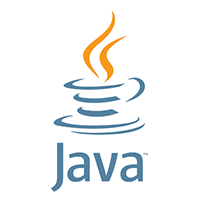

# Spring Framework - SpringBoot

O Spring Framework baseia-se no padrão de injeção de dependências enquanto que o spring Boot foca na configuração automática.

## Technical skills

    
    
    
    

## O que é Spring Boot?
O Spring Boot é um framework Java open source que tem por objetivo facilitar o processo de construção de aplicações Java.
Trazendo mais agilidade para o desenvolvimento, uma vez que devs conseguem reduzir o tempo gasto com as configurações iniciais.
Com o Spring Boot conseguimos abstrair e facilitar a configuração de, por exemplo:
+ Servidores;
+ Gerenciamento de dependências;
+ Configurações de bibliotecas;
+ Métricas & health checks;
+ E muito mais!!

    

## Características
+ Crie aplicativos Spring independentes;
+ Incorpore Tomcat, Jetty ou Undertow diretamente (sem necessidade de implantar arquivos WAR);
+ Forneça dependências 'iniciais' opinativas para simplificar sua configuração de compilação;
+ Configure automaticamente bibliotecas Spring e de terceiros sempre que possível;
+ Forneça recursos prontos para produção, como métricas, verificações de integridade e configuração externalizada;
+ Absolutamente nenhuma geração de código e nenhum requisito para configuração XML.

Dado que a maior parte das configurações necessárias para o início de um projeto são sempre as mesmas,
por que não iniciar um projeto com todas estas configurações já definidas?

    
    <footer>
        <a href="https://glysns.gitbook.io/spring-framework/core">Spring versus Spring Boot</a>
    </footer>

## Spring Boot Starters
Os starters são dependências que agrupam outras dependências com um propósito em comum.
Dessa forma, somente uma configuração é realizada no gerenciador de dependências. 
Por exemplo, o spring-boot-starter-test, é um starter que permite a construção de teste.
Ele contém a maioria dos elementos necessários para os testes de uma aplicação. 
Existem vários tipos diferentes de testes que podemos escrever para ajudar a testar e
automatizar a integridade de um aplicativo. Com o Spring Boot, precisamos apenas adicionar a
dependência (starter) spring-boot-starter-test para testá-la. 
Ao realizar a configuração no arquivo pom.xml da aplicação, se define somente o starter:
~~~xml
<dependency>
    <groupId>org.springframework.boot</groupId>
    <artifactId>spring-boot-starter-test</artifactId>
    <scope>test</scope>
</dependency>
~~~
Ele extrai todas as dependências relacionadas a testes. Depois de adicioná-lo, podemos construir
um teste de unidade simples. Na dependência acima, temos o escopo do teste <scope>test</scope>.
Isso significa que quando o aplicativo é agrupado e empacotado para implantação, qualquer dependência
declarada com os escopos de teste será ignorada. As dependências do escopo de teste
estão disponíveis apenas durante a execução nos modos de desenvolvimento e de teste do Maven.

## Benefícios do uso do Starter
+ Coesão
+ Versões compatíveis
+ Otmização do tempo
+ Configuração simples
+ Foco no negócio

### Alguns Starters disponíveis
#### spring-boot-starter-*
+ data-jpa: Integração ao banco de dados via JPA - Hibernate.
+ data-mongodb: Interação com banco de dados MongoDB.
+ web: Inclusão do container Tomcat para aplicações REST.
+ web-services: Webservices baseados na arquitetura SOAP.
+ batch: Implementação de JOBs de processos.
+ test: Disponibilização de recursos para testes unitários como JUnit
+ openfeign: Client HTTP baseado em interfaces
+ actuator: Gerenciamento de monitoramento da aplicação.

